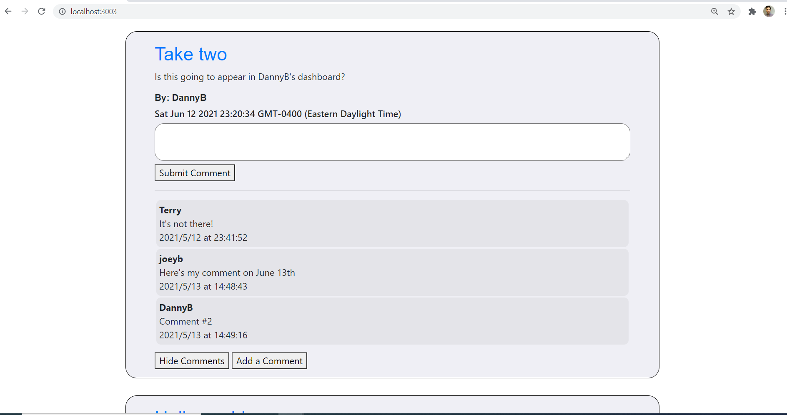

# Tech Blog with Handlebars - Bootcamp Spot
## Author: WellAndGood

# Table of Contents
* [Overview](#overview)
* [Appearance](#appearance)
* [Features](#features)
* [Contributors](#contributors)
* [License](#license)

# Overview

This document describes the components of a tech blog using Javascript, Node, Express, sessions, and is deployed on Heroku. 
Why did we create a tech blog? Because we know for a fact that the world needs another one!

# Appearance 
You can access the web application directly with the following link: https://techs-mechs-blog.herokuapp.com/

Once loaded, the generated HTML page should look like this:  

Clicking on the 'Login' button on the nav bar brings you to the registration, which allows you to create a new account or log in using existing credentials: 
  

Once you've logged in, you are taken to your dashboard; it will be empty if you have a new account. Otherwise, it will have your already-posted blogs, as shown here:
 

Clicking on any individual blog's title provides a unique URL with a dedicated web-page for that blog.

Each blog has a working 'View All Comments' and 'Add Comment' button. The former, when clicks, pops in all comments associated to that blog and toggles with a 'Hide All Comments' button. The later generates a textarea and 'Submit Comment' button. You can not submit a comment if you are not a registered user.

You can access the `.git` files at:
https://github.com/WellAndGood/TechBlogHandlebars.git

A video explaining the functioning of this app can be found here:
https://techs-mechs-blog.herokuapp.com/

# Features

- A logged-in user has access to more functions; they have a dashboard, where they can:
    - Create a new blog
    - Delete an existing blog
    - Comment on their own blog and other people's blogs, and have them visible to all

## Bugs

- It is not obvious to the user whether their comment has been processed; it only works for logged in users.
- It is not always obvious, after commenting or adding a new blog, that it was processed. It usually does process, and is visible, when does through Heroku.

## Contributors
Daniel Pisani (WellAndGood)

# Contact
* GitHub account: WellAndGood

## License
This project is licensed under:

### MIT License

Copyright (c) 2021 Daniel Pisani (WellAndGood) 

Permission is hereby granted, free of charge, to any person obtaining a copy of this software and associated documentation files (the "Software"), to deal in the Software without restriction, including without limitation the rights to use, copy, modify, merge, publish, distribute, sublicense, and/or sell copies of the Software, and to permit persons to whom the Software is furnished to do so, subject to the following conditions:

The above copyright notice and this permission notice shall be included in all copies or substantial portions of the Software.

THE SOFTWARE IS PROVIDED "AS IS", WITHOUT WARRANTY OF ANY KIND, EXPRESS OR IMPLIED, INCLUDING BUT NOT LIMITED TO THE WARRANTIES OF MERCHANTABILITY, FITNESS FOR A PARTICULAR PURPOSE AND NONINFRINGEMENT. IN NO EVENT SHALL THE AUTHORS OR COPYRIGHT HOLDERS BE LIABLE FOR ANY CLAIM, DAMAGES OR OTHER LIABILITY, WHETHER IN AN ACTION OF CONTRACT, TORT OR OTHERWISE, ARISING FROM, OUT OF OR IN CONNECTION WITH THE SOFTWARE OR THE USE OR OTHER DEALINGS IN THE SOFTWARE.
